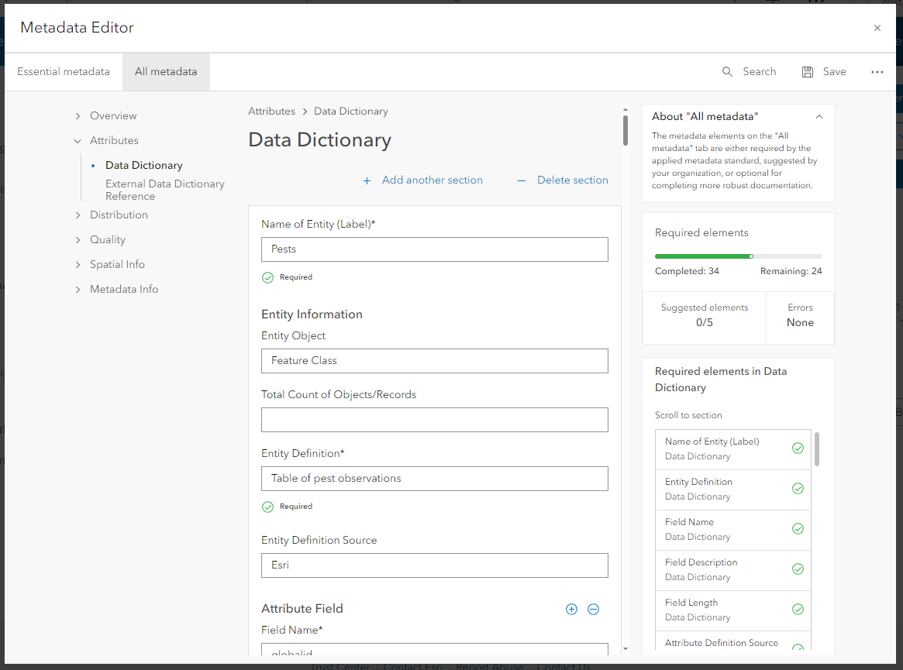
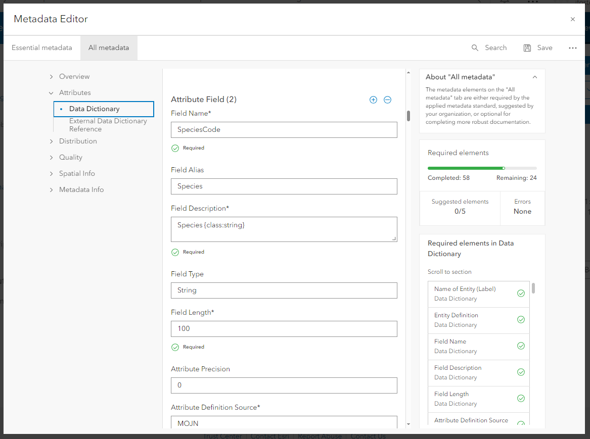
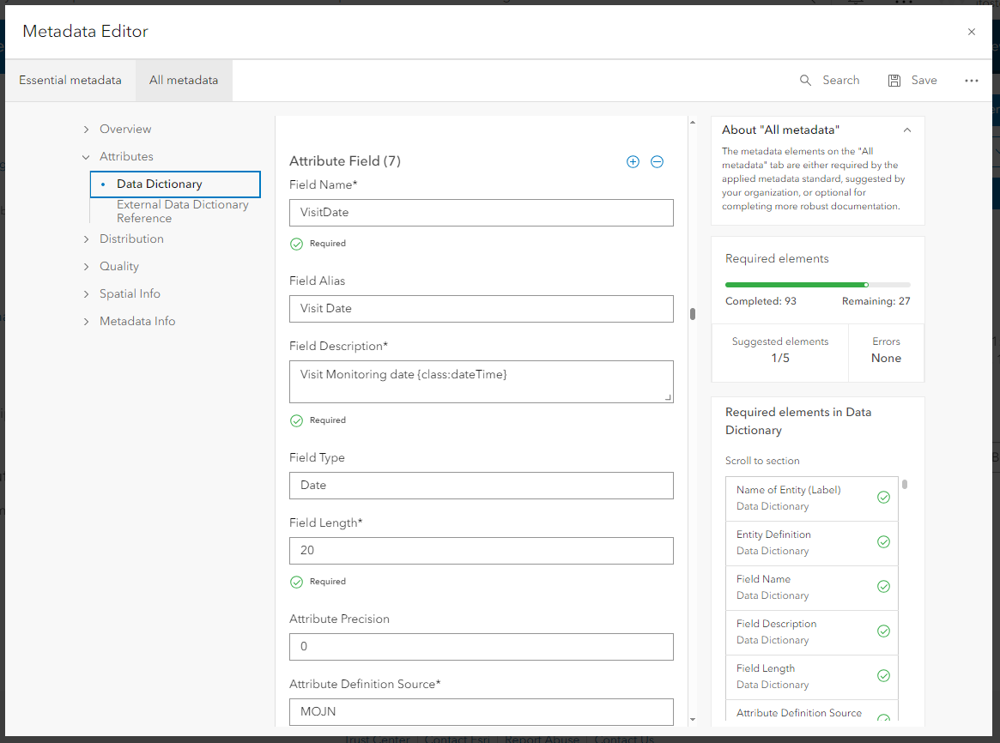
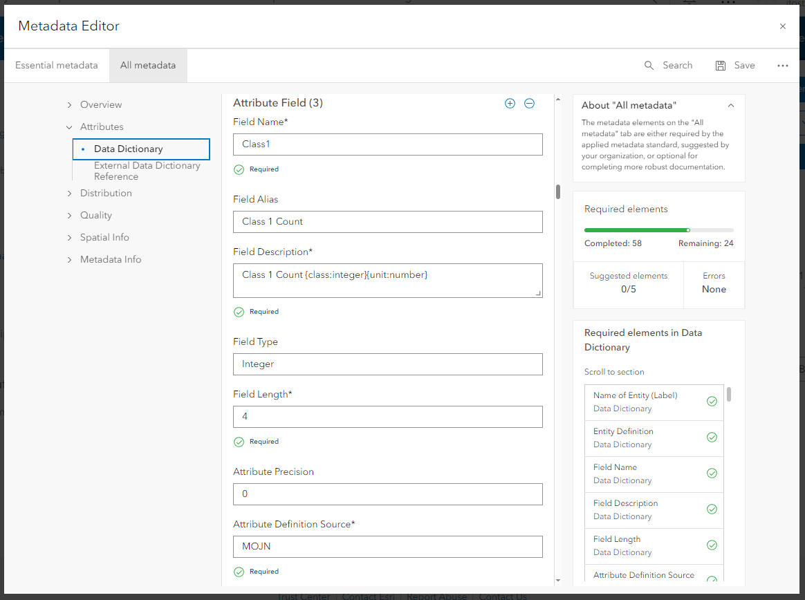

# About this package

Add info

This R package pulls data from an ArcGIS Online (AGOL) database into RStudio. It uses the httr package to query the metadata and data from the AGOL database.  

# Before using package

## Fill out metadata in AGOL database

For **each of the tables** in the database (not for the entire feature layer) you must fill out the Entity (table) and Attribute metadata. This is found in each table under `Metadata -> All metadata -> Attributes -> Data Dictionary`. If using metadata editor classic it can be found under `Open in Metadata Editor Classic -> Fields -> Entity and Attribute Information -> Entity and Attribute Details`. Here you must fill out the information for the table and each of the attributes in the table. See example below for help. If there is an attribute you don't want imported into R, you can skip filling out its metadata.

Field Name, Field Alias, and Field Type can be found on the `Fields` tab of the `Data` section of each table in AGOL. Class is the EML type and must be specified in the Field Description. It can be a string, integer, decimal, or dateTime. For integer and decimal classes units should be provided. Standard EML units can be found [here](https://sbclter.msi.ucsb.edu/external/InformationManagement/EDI/units/EML_units_preferred.html). If you have a unit that isn't found on the list, you can still use the unit and during the publication process described it as a "customUnit". 

#### Metadata Examples {.tabset}


##### Entity Example



##### String Example



##### Date Example



##### Integer Example



##### Double Example


### Lookup tables
If an attribute has a look up table it can be linked to the attribute. At the bottom of the information for the attribute select `Add section card -> Codeset Domain`. Then enter the name of the lookup table and its link. The lookup table must have a `name` and `label` column to generate the metadata CSVs.

<!--  -->
<center>


</center>


### Trouble shooting metadata

If the metadata is not filled out correctly the code will run into problems when importing or exporting the data and metadata.

#### Trouble shooting when importing data
By default `fetchRawData()` imports the metadata information and then queries the data using the metadata information. However, if the metadata is unable to import or if the metadata query has invalid parameters, the data will import independently. If this happens, there will either be A) no metadata or B) metadata that doesn't match the data.

If no metadata imported most likely one (or more) of the tables in your database does not have the metadata filled out. Simply go to AGOL and fill out the metadata using the steps above.

If the metadata imported but the query failed, that means that there are differences between the metadata and data. Most likely this is a difference in column names between the two. This will have to be fixed by going into the metadata in AGOL and fixing the discrepancies. To find out where the differences are run `troubleshootMetadata()`. By default this returns a list where every element is a data frame containing data column names that don't exist in the metadata and vice versa. See example below. It is fine if a column exists in the data table that doesn't exist in the metadata (like `objectid` below). However, all metadata columns must exist in the data table. You can see in the example below there is an extra space in `globalid` in the metadata column name and an extra column called `visit`. To fix this go into the data table on AGOL, fix the differences, and re-import the data by running `fetchRawData()` again.  

<center>


</center>

#### Trouble shooting when writing data

If the metadata imported and the data was imported by querying the metadata, there still might be problems in the metadata. There could be problems even if the data and metadata successfully write to CSVs. At this point the problems would probably be missing or incorrect metadata in a field other than the column name field such as definition, class, or unit. Running `troubleshootMetadat()` with the parameter `allInfo = TRUE` can help expose certain problems such as a missing definition, a non-valid class, or an integer or double with no unit. In the example below the data and metadata successfully wrote to CSVs. However, after running `troubleshootMetadat(all_data, allInfo = TRUE)` we can see that there is a missing definition, a non-valid metadata class, and an integer with a missing unit. To fix these problems go into the data table on AGOL, fix the problems, and re-import the data by running `fetchRawData()` again.   

<center>


</center>  

## Setting up a headless account

To use the AGOL API you should have a headless account for scripting that has permission to access the AGOL database. It is recommended to save your headless account password using the `keyring` package to avoid hard coding your password into function. To add headless account information to the default keyring follow the steps below. The code should only have to be run once.

``` r
# Run the function below. Change the username field to the username of your headless account and input the password when prompted
keyring::key_set(service = "AGOL", username = "USERNAME", prompt = "Password for headless account: ")

# To check the key was saved run code below, filling in the username to your headless account
keyring::key_get(service = "AGOL", username = "USERNAME")
```


